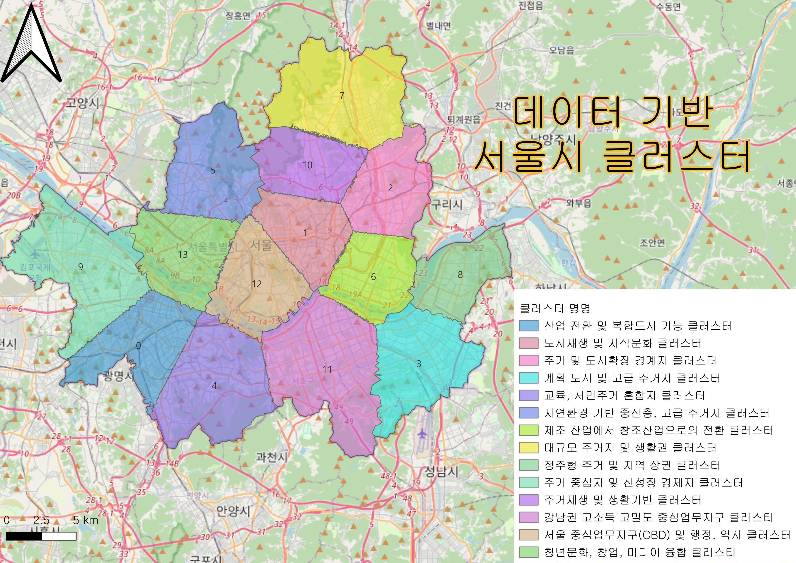

# GIS_Project

## 프로젝트 개요:

**서울시 건물물리정보 기반의 공간 군집 분석**

### 1. 분석 배경 및 목표

기존의 서울시 공간 군집 분석은 대부분 인구, 소득, 연령 등 인구사회학적 데이터를 기반으로 이루어졌으며, 그 결과로 강남3구(강남, 서초, 송파), 강북지역, 영등포 등과 같이 이미 널리 알려진 공간 클러스터들이 반복적으로 등장하는 경향이 있습니다.
하지만 우리는 \*\*서울을 물리적인 건축 환경의 관점에서 새롭게 바라볼 수는 없을까?\*\*라는 문제의식에서 출발하였습니다.
따라서 이번 프로젝트의 목적은 **서울시의 건물정보를 기반으로 공간 군집을 시도함으로써, 물리적 도시구조의 패턴을 발견하고 이를 해석**하는 것입니다.

---

### 2. 데이터 및 변수

분석에는 \*\*서울시의 용도별 건물정보 데이터 (shapefile)\*\*를 활용하였으며, 이 데이터에는 각 건물의 위치와 속성이 포함되어 있습니다.
그중 다음 5개의 벡터 데이터를 사용하여 군집분석을 수행했습니다:

* **용적률** (Floor Area Ratio)
* **건폐율** (Building Coverage Ratio)
* **건물 높이** (in meters)
* **총 층수** (지상 + 지하)
* **건물 나이** (현재 연도 - 승인일자)

---

### 3. 1차 군집 분석: GEO-SOM

첫 번째 군집화 방법으로는 **GEO-SOM (Geographically Weighted Self-Organizing Map)** 알고리즘을 사용했습니다.

* **20x20 grid**를 구성하여 데이터를 학습시켰으며,
* 각 건물은 GEO-SOM에 의해 특정 클러스터로 할당되었습니다.

이후, 각 건물을 포인트로 시각화하고, 해당 포인트들을 기반으로 \*\*보로노이 다이어그램(Voronoi Polygon)\*\*을 생성하였습니다.

* 보로노이 면적의 각 셀에는 해당하는 클러스터 번호를 할당하여 **공간적인 군집지도를 구성**하였습니다.

#### 문제점 발견:

* GEO-SOM의 특성상 **군집의 수가 많고 공간적으로 분산**되는 현상이 나타남
* 시각적으로도 **해석이 어려울 정도로 세분화된 결과**가 나와서 추가적인 군집 압축이 필요하다는 판단

---

### 4. 2차 군집 분석: K-Means + Gap Statistic

위 문제를 해결하기 위해 두 번째 군집화 단계로는 **K-Means 알고리즘**을 적용하였습니다.

* K-Means는 **유클리디언 거리 기반** 알고리즘으로, 일반적으로 이상치에 민감하지만,
  서울시 내 건물 데이터는 극단적인 이상치가 적고 분포가 제한적이므로 K-Means 적용이 타당하다고 판단하였습니다.

#### 클러스터링 입력:

* 각 건물 포인트의 좌표 (x, y)
* GEO-SOM을 통해 할당된 클러스터의 중심좌표 (x’, y’)
  → 총 **4차원의 좌표 정보**를 바탕으로 K-Means 클러스터링 수행

#### 군집 수 결정:

* **Gap Statistic** 기법을 사용하여 최적의 군집 수를 탐색하고 적용

#### 결과:

* GEO-SOM의 세분화된 군집을 K-Means를 통해 **공간적으로 응집력 있는 군집들로 재구성**
* 시각적으로 해석이 용이하며, 건물 물리정보 기반의 서울시 패턴을 효과적으로 요약 가능

---

### 5. 결론 및 의의

본 분석은 다음과 같은 차별성과 실용적 의의를 가집니다:

* **비전통적 접근**: 인구통계가 아닌 건축 물리정보 기반으로 도시를 분류함
* **새로운 공간적 시각 제공**: 행정구역이나 기존 인식과 다른 건축학적 패턴의 도시 공간을 제시
* **도시계획 및 리노베이션 전략에 응용 가능**: 노후도, 밀도, 높이 등을 기준으로 한 지역 재생, 규제 완화 또는 개발 계획 수립에 활용 가능

2025 GIS Project repo

GIS_Project_GEO_SOM.ipynb 파일은 서울시 건물정보 데이터를 활용하여, GEO-SOM알고리즘을 학습시킨다.   
건물데이터의 다차원 특성이 반영되어 할당된 cluster들은 보르노이(Vornoi) 폴리곤으로 면적을 할당한다.

GEO_SOM_Seoul_K_Means.ipynb 파일은 할당된 클러스터들을 유클리디언 거리기반의 k-means알고리즘을 통하여   
서울시의 건물정보기반의 군집을 형성한다. 이때, 최적의 군집의 수를 확인하기 위하여, Gap-statistics를 사용하여   
선정된 군집의 수로 서울을 나눈다.   

코드의 독해를 위하여, GEO-SOM알고리즘, Vornoi폴리곤 자르기, Gap-statistics는 utils.py 파일에   
저장 후, 함수만을 꺼내서 사용하였다.
